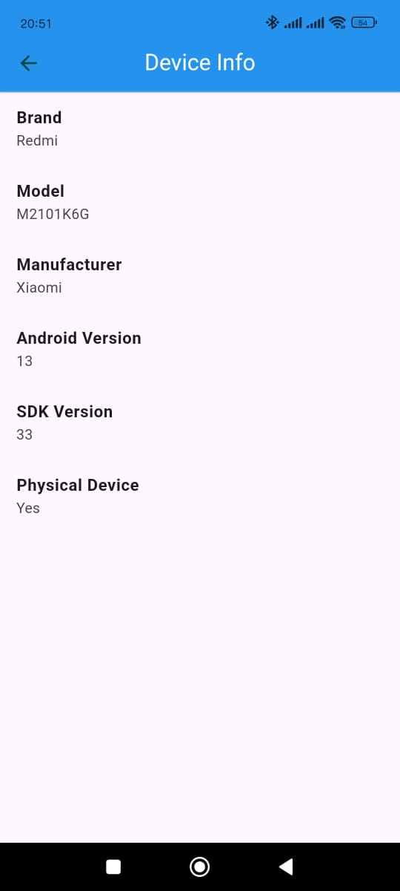

# Device Power App
### This app is built to test the uses of the device features and managing it

<table border="1">
  <tr>
    <th>Home Page</th>
    <th>Device Info</th>

  </tr>
  <tr>
    <td></td>
        <td></td>

  </tr>

  <tr>
    <th>My Gallery Page - empty page</th>
    <th>My Gallery Page - options bottom bar</th>
    <th>My Gallery Page - pictures added</th>
    <th>My Gallery Page - options bottom bar with clear option</th>
    
  </tr>
  <tr>
    <td></td>
    <td></td>
    <td></td>
    <td></td>
    
  </tr>

  <tr>
    <th>My location to Cairo</th>
  </tr>
  <tr>
    <td></td>
  </tr>
</table>